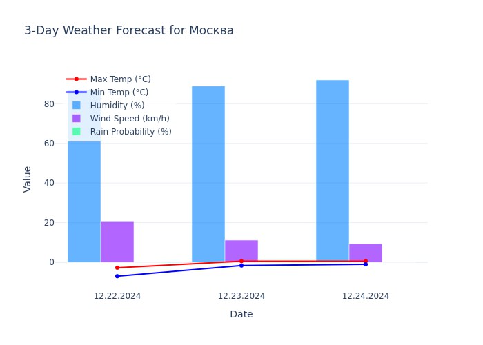
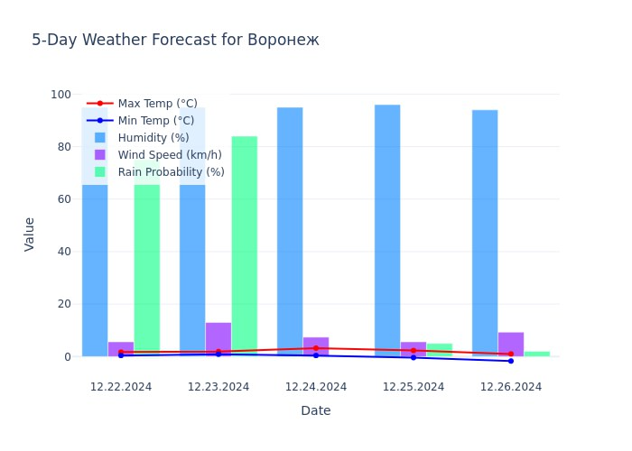
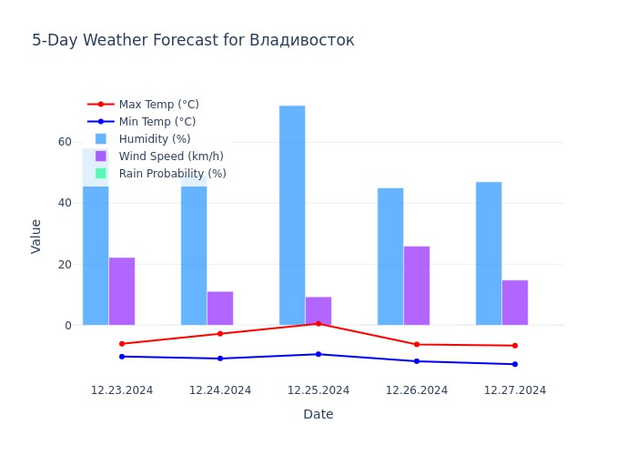

# Setup
edit docker-compose.yml and enter API_KEY with accuweather api key and TG_KEY with tg key
```bash
docker compose up --build -d
```
# Info
this project help you plan your travel (check weather, humidity, rain probability in some cities)

# Examples of forecasts



